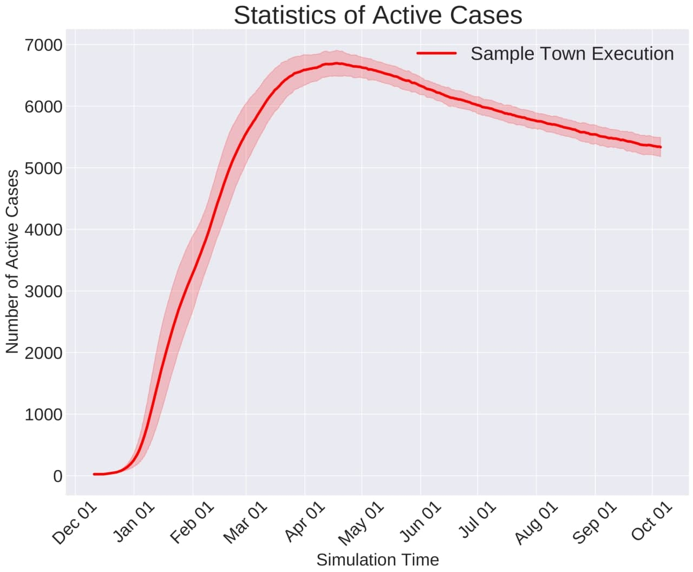
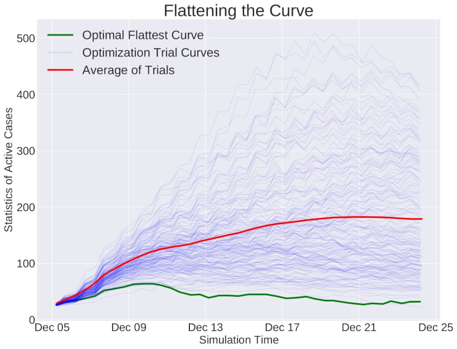
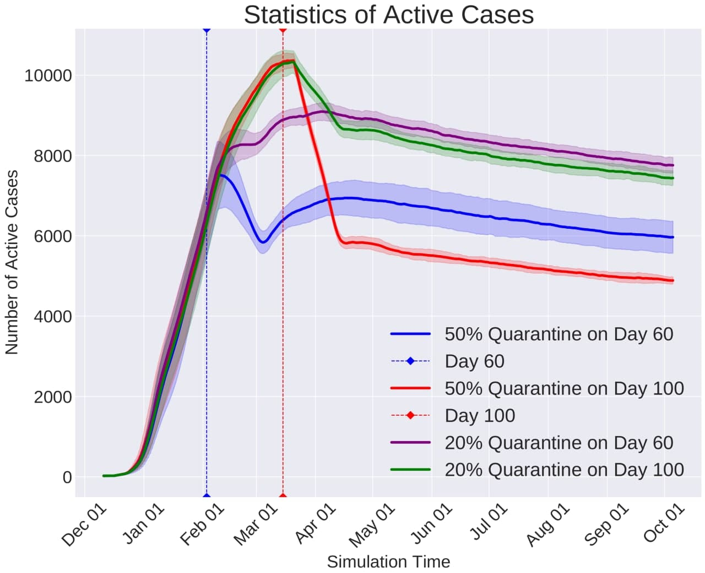
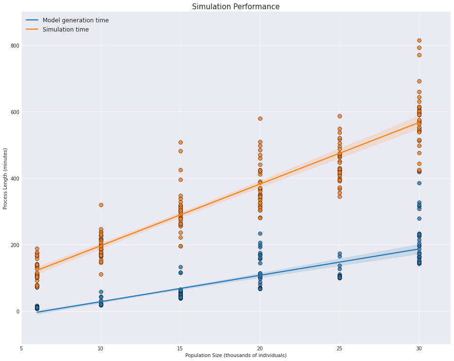

# Pyfectious

Simulating the spread of epidemic diseases in human communities is critical for predicting the disease behaviour and verifying different policies to control the infection. Many existing simulators and models are compartment models, meaning that they divide people into several subsets and simulate the dynamics among those subsets.

These models lack the required granularity to study the effect of policies that influence every individual in a certain way. In this work, we introduce a simulator that allows modeling the structure and dynamics of a city at the level of individuals. We have developed a probabilistic generative model for the population that allows sampling every feature of the crowd from a specified probability distribution.

This embedded probabilistic nature makes the model generic and less dependent on the information of a specific city. Therefore, downstream tasks such as controlling the disease's spread can be evaluated on a set of similar cities, ensuring that the policy is robust to uncertainties in the population model.

Finally, here are some of our experiment results. These experiments are performed on one of our sample towns located in [json folder](data/json), more details may be found in the respective README files inside some of the main configuration folders. In order to understand how to deploy your first simulation, take a look at the materials introduced in the next section. For further information, refer to our [technical report](https://arxiv.org/abs/2103.15561).

<p align="center">
 
</p>

---

<p align="center">
 
</p>


## Getting started

Here are some quick instructions about getting familiarized with Pyfectious environment and capabilities.

### General structure
To acquire a better understanding of the simulator's environment and features, you just need to clone the repository into your local machine. At first glance, the overall structure of the project appears below.

    ├── src          # Python source files of the project.
    ├── cluster      # Tools and scripts to run on the cluster.
    ├── data         # Simulator's database and configuration files.
    ├── requirements.txt
    ├── LICENSE
    └── README.md

### Tutorials
After knowing the general structure of the repository,
the best place to start is our comprehensive [Google Colaboratory Notebook](https://colab.research.google.com/drive/1LNOwU-qUjLaHQpqIoKuUZyaNN77BQN3u?usp=sharing), dedicated to explaining
fundamental features of Pyfectious and how to perform simulations in the simplest possible way. To use it properly, either download
the notebook to your personal computer (not recommended) or make a copy on Google Colaboratory (or Google Drive) to save your progress, modifications, and even results.


Note that when running the notebook on Colaboratory website, there are no requirements to be installed separately, one just needs
to follow the indicated instructions, and the necessary libraries should get installed automatically.

To start with the **tutorials** right now, hit the button below:

[](https://colab.research.google.com/drive/14UYB9x0g5s7jyHO4DynqDJMXTaSM11eW?usp=sharing)

In case you are not familiar with how Google Colaboratory works, hit the following button to access the **Colaboratory's getting started guide**.

[](https://colab.research.google.com/notebooks/intro.ipynb)

### Prerequisites

If you wish to run the code or some tutorials locally, you need to install the requirements of the project
by executing the following command.

```commandline
pip install -r requirements.txt
```

Alternatively, you can manually install the requirements listed in the requirements.txt. A newer and backward compatible version of python packages mentioned in [requirements.txt](requirements.txt) is also functional.

### Coding Style

The coding style of this project is entirely in accordance with [PEP 8](https://www.python.org/dev/peps/pep-0008/), except for the case of some class names. The longer class names are often separated with an underscore ( _ ) to increase readability.

### Performance
If you're curious about the simulator's performance, the following plot incorporates the required time for both simulation and model generation procedures. Clearly, the simulator is designed to have a linear complexity with respect to population growth.


<p align="center">

</p>

## Contributing

Please read [CONTRIBUTING.md](CONTRIBUTING.md) for details on our code of conduct, and the process for submitting **pull requests** to us.

## Citation

Please use the following BibTeX formatted **citation**:

    @article{mehrjou2021pyfectious,
      title={Pyfectious: An individual-level simulator to discover optimal containment polices for epidemic diseases},
      author={Mehrjou, Arash and Soleymani, Ashkan and Abyaneh, Amin and Sch{\"o}lkopf, Bernhard and Bauer, Stefan},
      journal={arXiv preprint arXiv:2103.15561},
      year={2021}
    }

## Authors

* [Amin Abyaneh](https://github.com/aminabyaneh) -- **maintainer**
* [Ashkan Soleymani](https://github.com/Ashkan-Soleymani98)
* [Arash Mehrjou](https://github.com/amehrjou)

## License

This project is licensed under the MIT License - see the [LICENSE](LICENSE) file for details.
