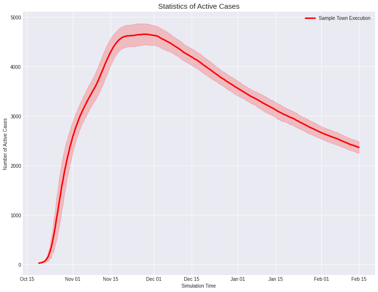

# PyFectious

Simulating the spread of epidemic diseases in human communities is critical for predicting the disease behaviour and verifying different policies to control the infection. Many existing simulators and models are compartment models, meaning that, they divide people into a number of subsets and simulate the dynamics among those subsets. 

These models lack the required granularity to study the effect of policies that influence every individual in a certain way. In this work, we introduce a simulator that allows modeling the structure and dynamics of a city at the level of individuals. We have developed a probabilistic generative model for the population that allows sampling every feature of the crowd from a specified probability distribution. 

This embedded probabilistic nature makes the model generic and less dependent on the information of a specific city. Therefore, downstream tasks such as controlling the spread of the disease can be evaluated on a set of similar cities ensuring that the policy is robust to uncertainties in the population model.

Finally, here are some of our experiment results. These experiments are performed on one of our sample towns located in [json folder](data/json). In order to understand how to deploy your first simulation, take a look at the materials introduced in the next section. For further information, refer to our [technical report](). 

<p float="left">
 
</p>

## Getting Started

To acquire a better understanding of the simulator's environment and features, you just need to clone the repository into your local machine. In the first glance, the overall structure of the project appears like below.
    
    ├── src          # Python source files of the project. 
    ├── example      # Tutorials, sanity and performance checks.
    ├── cluster      # Tools and scripts to run on the cluster.
    ├── data         # Simulator's database and configuration files.
    ├── requirements.txt 
    ├── LICENSE
    └── README.md

Afterward, the best place to start is the [example](example) folder, where there are a couple of notebooks available to get you started with the simulator. A quick description of the notebooks are as the following.

    ├── example 
    │   ├── Configured_Simulation.ipynb    # Example of running a pre-configured simulation.
    │   ├── Manual_Simulation.ipynb        # Tutorial on starting a manual simulation.
    │   ├── Sanity_Check.ipynb             # Sanity checks related to simulation functionality.
    │   └── Performance_Test.ipynb         # Measure the simulator's performance on a machine.


### Prerequisites

To access the requirements of the project, you only need to execute the following command. 
```commandline
pip install -r requirements.txt
```

Alternatively, you can manually install the requirements listed in the requirements.txt. A newer and backward compatible version of python packages mentioned in [requirements.txt](requirements.txt) is also functional. 

### Coding Style

The coding style of this project is entirely in accordance with [PEP 8](https://www.python.org/dev/peps/pep-0008/), except for the case of some class names. The longer class names are often separated with underscore ( _ ) to increase readability.

### Performance 
If you're curious about the simulator's performance, the following plot incorporates the required time for both simulation and model generation procedures. Clearly, the simulator is designed to have a linear complexity with respect to population growth.


This plot is prepared and generated using [Generate_Plots.ipynb](cluster/Generate_Plots.ipynb) notebook.
## Contributing

Please read [CONTRIBUTING.md]() for details on our code of conduct, and the process for submitting pull requests to us.

## Authors

* [Amin Abyaneh](https://github.com/PurpleBooth) -- maintainer
* [Ashkan Soleymani](https://github.com/PurpleBooth) 
* [Arash Mehrjou](https://github.com/PurpleBooth) 

## License

This project is licensed under the MIT License - see the [LICENSE](LICENSE) file for details.

